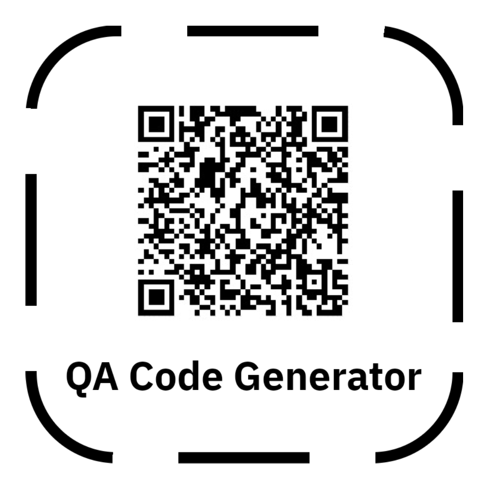

<!-- Improved compatibility of back to top link: See: https://github.com/othneildrew/Best-README-Template/pull/73 -->

<!--
*** Thanks for checking out the Best-README-Template. If you have a suggestion
*** that would make this better, please fork the repo and create a pull request
*** or simply open an issue with the tag "enhancement".
*** Don't forget to give the project a star!
*** Thanks again! Now go create something AMAZING! :D
-->

<!-- PROJECT SHIELDS -->
<!--
*** I'm using markdown "reference style" links for readability.
*** Reference links are enclosed in brackets [ ] instead of parentheses ( ).
*** See the bottom of this document for the declaration of the reference variables
*** for contributors-url, forks-url, etc. This is an optional, concise syntax you may use.
*** https://www.markdownguide.org/basic-syntax/#reference-style-links
-->
[![Contributors][contributors-shield]][contributors-url]
[![Forks][forks-shield]][forks-url]
[![Stargazers][stars-shield]][stars-url]
[![Issues][issues-shield]][issues-url]
[![MIT License][license-shield]][license-url]
[![LinkedIn][linkedin-shield]][linkedin-url]

<!-- PROJECT LOGO -->
 

  

<h3 align="center">QA CODE GENERATOR</h3>

  

    Simple QA Code generator using html, css and js.
     
     
    <a href="https://nekodarkz.github.io/QA-code-generator">View Demo</a>
    ·
    <a href="https://github.com/NekoDarkZ/QA-code-generator/issues">Report Bug</a>
    ·
    <a href="https://github.com/NekoDarkZ/QA-code-generator/issues">Request Feature</a>
  

<!-- USAGE EXAMPLES -->
## Usage

- [ ] Enter the QA generator online at: https://nekodarkz.github.io/QA-code-generator
- [ ] Enter a link.
- [ ] Click on "Generate".
- [ ] And you get the QA Code.

(<a href="#readme-top">back to top</a>)

<!-- CONTRIBUTING -->
## Contributing

Contributions are what make the open source community such an amazing place to learn, inspire, and create. Any contributions you make are **greatly appreciated**.

If you have a suggestion that would make this better, please fork the repo and create a pull request. You can also simply open an issue with the tag "enhancement".
Don't forget to give the project a star! Thanks again!

1. Fork the Project
2. Create your Feature Branch (`git checkout -b feature/AmazingFeature`)
3. Commit your Changes (`git commit -m 'Add some AmazingFeature'`)
4. Push to the Branch (`git push origin feature/AmazingFeature`)
5. Open a Pull Request

(<a href="#readme-top">back to top</a>)

<!-- LICENSE -->
## License

Distributed under the MIT License. See `LICENSE` for more information.

(<a href="#readme-top">back to top</a>)

<!-- CONTACT -->
## Contact

Sebastián Murquio Castillo - [@k0neda](https://twitter.com/k0neda) - samurquio@gmail.com

Project Link: [https://github.com/NekoDarkZ/QA-code-generator](https://github.com/NekoDarkZ/QA-code-generator)

(<a href="#readme-top">back to top</a>)

<!-- MARKDOWN LINKS & IMAGES -->
<!-- https://www.markdownguide.org/basic-syntax/#reference-style-links -->
[contributors-shield]: https://img.shields.io/github/contributors/NekoDarkZ/QA-code-generator.svg?style=for-the-badge
[contributors-url]: https://github.com/NekoDarkZ/QA-code-generator/graphs/contributors
[forks-shield]: https://img.shields.io/github/forks/NekoDarkZ/QA-code-generator.svg?style=for-the-badge
[forks-url]: https://github.com/NekoDarkZ/QA-code-generator/network/members
[stars-shield]: https://img.shields.io/github/stars/NekoDarkZ/QA-code-generator.svg?style=for-the-badge
[stars-url]: https://github.com/NekoDarkZ/QA-code-generator/stargazers
[issues-shield]: https://img.shields.io/github/issues/NekoDarkZ/QA-code-generator.svg?style=for-the-badge
[issues-url]: https://github.com/NekoDarkZ/QA-code-generator/issues
[license-shield]: https://img.shields.io/github/license/NekoDarkZ/QA-code-generator.svg?style=for-the-badge
[license-url]: https://github.com/NekoDarkZ/QA-code-generator/blob/main/LICENSE
[linkedin-shield]: https://img.shields.io/badge/-LinkedIn-black.svg?style=for-the-badge&logo=linkedin&colorB=555
[linkedin-url]: https://linkedin.com/in/samurquio
[product-screenshot]: images/screenshot.png
